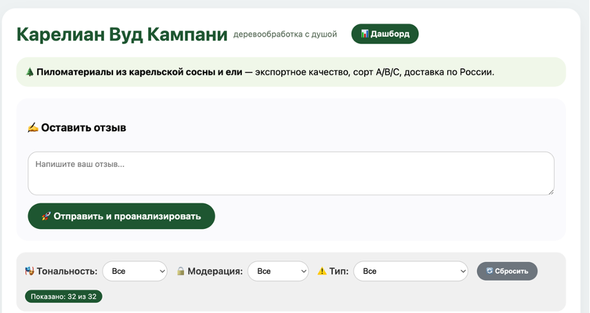
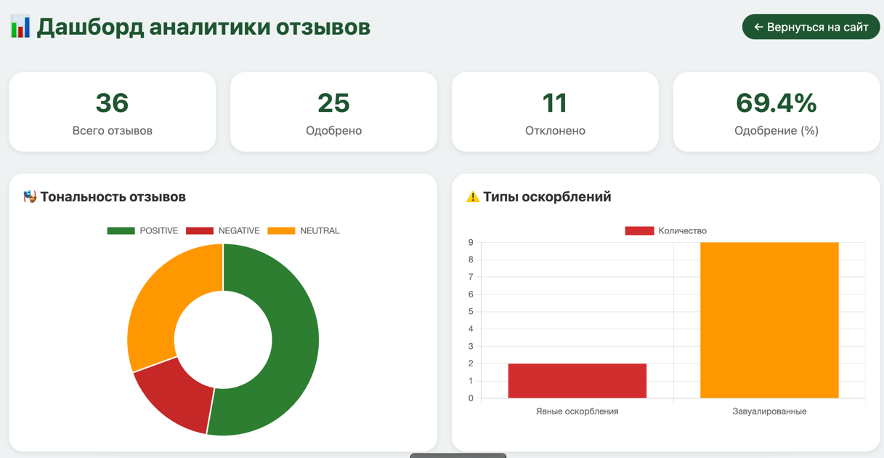
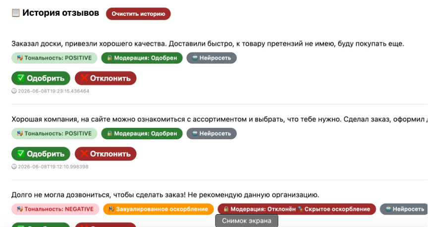

# Diplom_PAST

# Описание проекта

Данный проект представляет собой веб-приложение для автоматической модерации пользовательских отзывов. Система анализирует тональность текста (POSITIVE / NEGATIVE / NEUTRAL), выявляет явные и скрытые оскорбления (сарказм, иронию, завуалированную агрессию) с помощью дообученной нейросетевой модели на базе ruBERT tiny, а также предоставляет аналитический дашборд для визуализации статистики.

Проект разработан в рамках дипломной работы по специальности «Информационные системы и программирование» и предназначен для использования в компаниях, собирающих отзывы клиентов (например, в сфере электронной коммерции, лесопильной промышленности и др.).


## Основные функции

- Анализ тональности – определение эмоциональной окраски отзыва (POSITIVE / NEGATIVE / NEUTRAL).
- Детекция явных оскорблений – комбинация модели токсичности и чёрного списка (40+ слов).
- Выявление скрытых оскорблений – дообученная модель ruBERT tiny для распознавания сарказма, иронии и пассивной агрессии.
- Веб-интерфейс – отправка отзывов, история с цветными бейджами, фильтрация по тональности и статусу.
- Ручная модерация – кнопки «Одобрить»/«Отклонить» для переопределения решения нейросети администратором.
- Аналитический дашборд – графики распределения тональности, типов оскорблений, динамики по дням, топ-10 слов и облако слов (построены на Chart.js).
- Антиспам-защита – ограничение частоты отправки (не более 1 отзыва в 30 секунд с одного IP), защита от дубликатов, хеширование IP-адресов для соблюдения конфиденциальности (GDPR).

## Скриншоты


*Рис. 1 – Главная страница с формой отправки отзыва*


*Рис. 2 – Дашборд с графиками и облаком слов*


*Рис. 3 – История отзывов с цветными бейджами и кнопками модерации*

## Технологический стек

| Компонент            | Технология                                   |
|----------------------|----------------------------------------------|
| Backend              | Python 3.11, Flask                           |
| Машинное обучение    | Transformers (Hugging Face), PyTorch, ruBERT tiny |
| Frontend             | HTML, CSS, JavaScript, Chart.js              |
| Хранение данных      | JSON (файл reviews.json)                     |
| Среда разработки     | Visual Studio Code                           |


## Установка и запуск

### Требования

- Python 3.11 или выше
- pip (менеджер пакетов)

### Шаги

1. Клонируйте репозиторий:

```bash
git clone https://github.com/Vadimserikov/Diplom_PAST.git
cd Diplom_PAST
```

2. Установите зависимости:

```bash
pip install -r requirements.txt
```

3. (Опционально) Дообучите модель для скрытых оскорблений на вашем датасете:

- Поместите размеченный CSV-файл в `data/hidden_abuse_dataset.csv` (колонки: `text`, `label`; 0 – безопасно, 1 – скрытое оскорбление).
- Запустите скрипт дообучения:

```bash
python finetune_hidden_abuse.py
```

После завершения появится папка `model_hidden_abuse` с обученной моделью.

4. Запустите веб-сервер:

```bash
python app.py
```

5. Откройте браузер по адресу: [http://127.0.0.1:5000](http://127.0.0.1:5000)


## Структура проекта

```text
karelian-wood-moderator/
├── app.py                          # Основной сервер (Flask)
├── finetune_hidden_abuse.py        # Скрипт дообучения модели
├── ab_test.py                      # A/B тестирование (нейросеть vs эвристика)
├── requirements.txt                # Зависимости
├── reviews.json                    # Хранилище отзывов (создаётся автоматически)
├── model_hidden_abuse/             # Дообученная модель (генерируется)
│   ├── config.json
│   ├── model.safetensors
│   └── tokenizer.json
├── data/
│   └── hidden_abuse_dataset.csv    # Датасет для дообучения (пример)
├── templates/
│   ├── index.html                  # Главная страница
│   └── dashboard.html              # Дашборд
└── README.md
```


## Результаты A/B тестирования

Сравнение точности разработанной нейросети и эвристического подхода на сбалансированной выборке из 15 отзывов:

| Подход                                     | Точность | Ошибок |
|--------------------------------------------|----------|--------|
| Эвристика (чёрный список + ключевые фразы) | 73,3%    | 4/15   |
| Разработанная нейросеть                    | 93,3%    | 1/15   |

**Улучшение:** +20% в пользу нейросети.

Нейросеть успешно распознаёт сарказм и иронию, которые эвристика пропускает. Единственная ошибка нейросети – ложное срабатывание на отзыве «доска кривая, но обменяли» (модель не учла позитивное завершение).

Подробный отчёт A/B теста сохраняется в `ab_test_report.json`.


## Перспективы развития

- Авторизация с разделением ролей (администратор / модератор / пользователь).
- Автоматическое ежемесячное дообучение модели на новых отзывах.
- Интеграция с Telegram-ботом для уведомлений о новых отзывах и возможности удалённой модерации.


## Лицензия

Проект разработан в учебных целях и предоставляется «как есть» без каких-либо гарантий.


## Автор

**Сериков Вадим Андреевич**  
Студент группы ИС32  
ГАПОУ РК «Петрозаводский архитектурно-строительный техникум»  
Руководитель: Паталах Юлия Анатольевна


## Контакты

По вопросам сотрудничества или доработок обращайтесь через [GitHub Issues](https://github.com/Vadimserikov/Diplom_PAST/issues).
